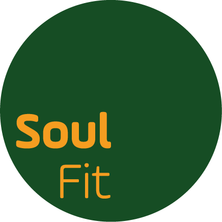

## A Soul Fit

[//]: 

<i class="fas fa-graduation-cap fa-lg"></i> Psicóloga pela Universidade Federal Fluminense, Mestre em Psicologia Social, do Trabalho e das Organizações pela Universidade de Brasília, com pesquisa em qualidade de vida no trabalho dos pilotos do transporte aéreo público regular de passageiros no Brasil.

<i class="far fa-address-card fa-lg"></i> Credenciada pelo Centro de Investigação e Prevenção de Acidentes Aeronáuticos para investigação e prevenção de acidentes e incidentes aeronáuticos, com foco nos Fatores Humanos.

<i class="fas fa-briefcase fa-lg"></i> Foi Chefe da Assessoria de Fatores Humanos do referido Centro, onde participou da confecção e revisão de Relatórios Finais emitidos pelo CENIPA; da formação de profissionais para atuação na investigação e prevenção no âmbito SIPAER; da regulamentação, capacitação e acompanhamento da atuação dos psicólogos e médicos credenciados no Brasil para a condução das atividades de investigação e prevenção no âmbito dos Fatores Humanos; e da composição de comissões para trabalhos de prevenção, treinamentos e investigação de acidentes aeronáuticos da aviação civil e militar brasileira.

<i class="fas fa-chart-line fa-lg"></i> Participou no CENIPA de projetos de pesquisa para aprimoramento da metodologia de investigação dos Fatores Humanos, atualização do programa de CRM, gerenciamento da fadiga e elevação dos níveis de segurança de voo nas unidades áreas da FAB.

<i class="far fa-check-square fa-lg"></i> Possui também experiência com gestão de RH, treinamento, recrutamento e seleção em instituições como Instituto de Psicologia da Aeronáutica, TIM Celular S/A, Intelig Telecom, Correios e Universidade Federal Fluminense.

[//]: To learn how to install and use this theme check out the [Setup Guide](http://taylantatli.me/Moon/moon-theme/) for more information.

[//]: [Exemplo de link formato button]( {{ site.url }} ){: .btn}
